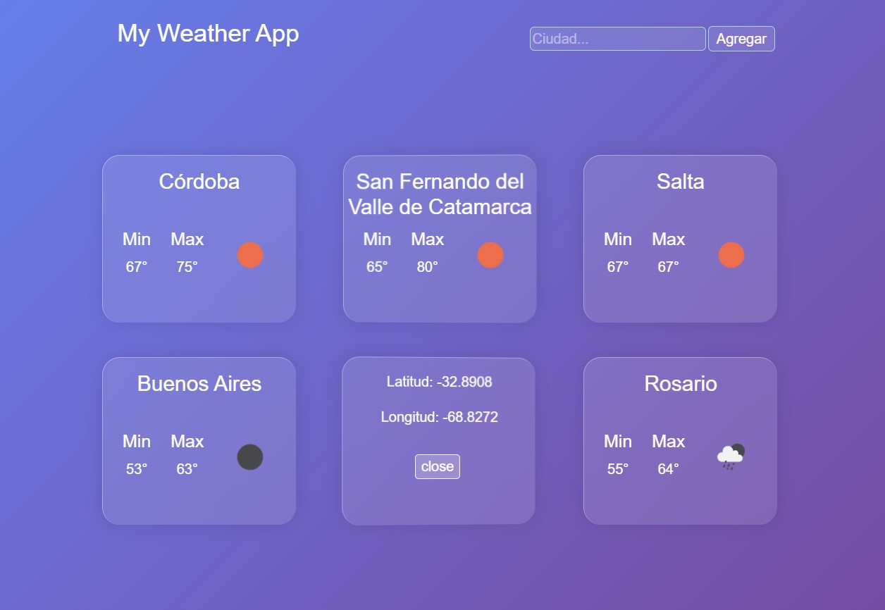
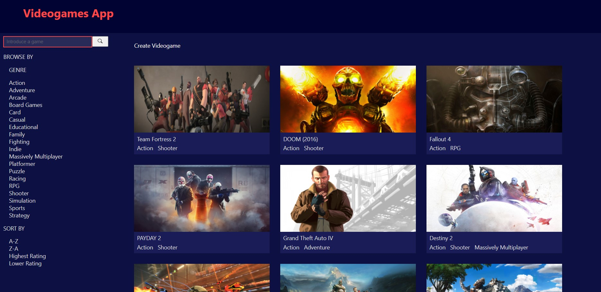
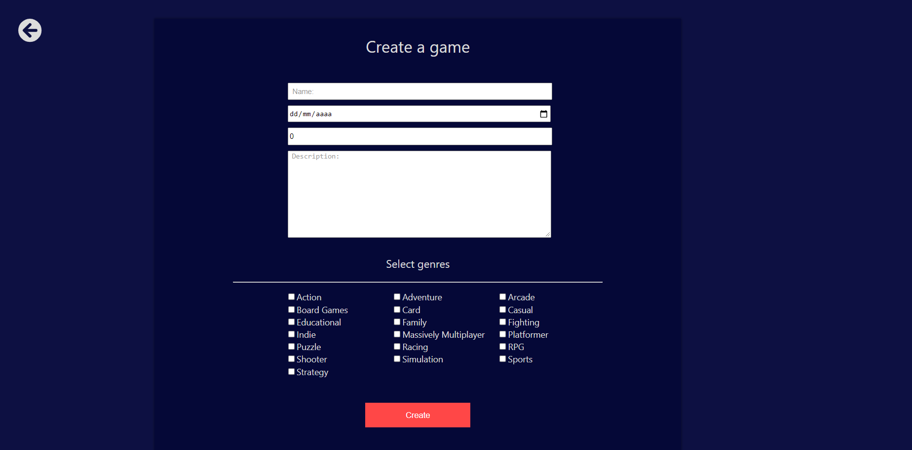
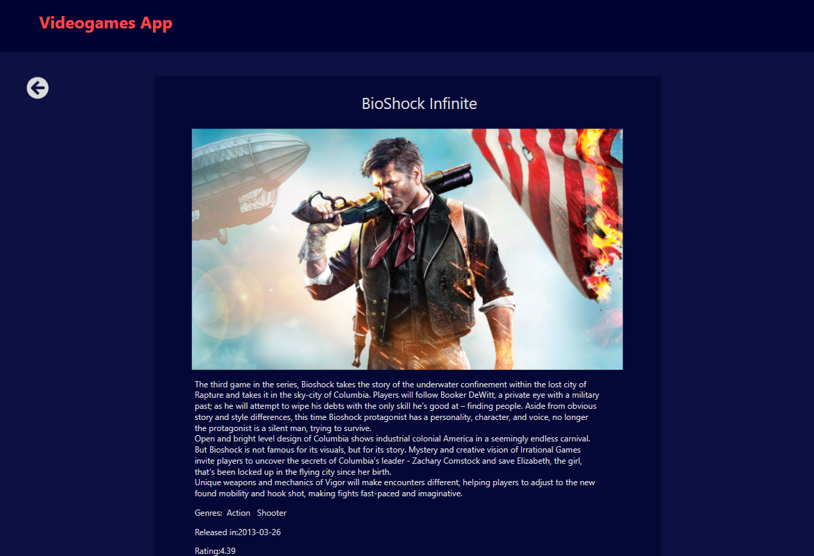

# 
```js
mePresento = 'Hola, mi nombre es Franco 👋 💻' 
```
```js
🎯unPocoSobreMi = `Soy un Desarrollador Full Stack 🕺 que tiene el foco y entusiasmo 
                                en implementar y aprender nuevas tecnologías. `
```
 <br>

```javascript
let francoandrada = {
 💪skills: {
    backEnd: {
      javaScript: ['NodeJs', 'Express', 'Sequelize'],
      php: ['Laravel', 'Eloquent']
    },
    frontEnd: {
      javaScript: ['React', 'Redux', 'Hooks'],
      css: ['Less', 'Bootstrap', 'Styled-Components']
    },
    databases: ['MySQL', 'PostgreSQL']
  }
}

```
 <br>
 
```js
Proyectos recientes 👇👇👇
``` 

```js
🕺HARDWARESTORE🕺 
```
  <dl>
  <a href="https://github.com/francoandrada/WeatherApp">

  </a>
  </dl>
<br><br><br>


```js
🕺VIDEOGAMES APP🕺
```
<a href="https://github.com/francoandrada/PI-Videogames">

<br><br>
     
<br><br>
   
<br><br>

</a>
<br><br><br>


```js
🕺WHEATHER APP🕺 
```
  <dl>
  <a href="https://github.com/francoandrada/WeatherApp">

  </a>
  </dl>
<br><br><br>


✔ contacto= {<br>
  &nbsp; 📫e-mail: 'francoarganiaraz@gmail.com', <br>
  &nbsp; 💻linkedIn:  <a href="https://www.linkedin.com/in/franco-andrada-dev/"> https://www.linkedin.com/in/franco-andrada-dev/</a></h3><br>
}
